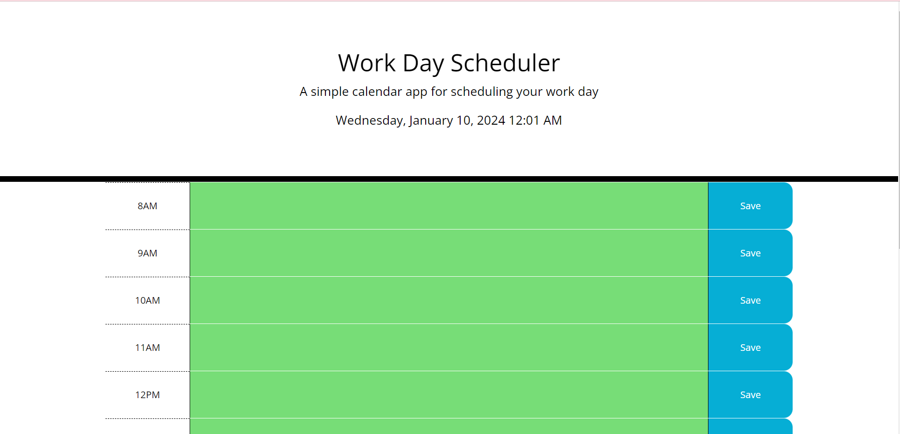

# Daily Planner App
This Daily Planner application is designed to help users organize their day by providing a schedule broken down into hourly time blocks. Users can input tasks or notes for each hour and save them to be accessed later.
## Features
### Time Blocks 
The app displays time blocks for each hour of the day.
### Task Input 
Users can input tasks or notes for specific hours into the provided text areas.
### Save Functionality 
Users can save tasks or notes for each hour.
### Persistent Storage 
The app uses local storage to persist data, allowing users to access their schedule even after refreshing the page.
### Color Coding 
Time blocks are color-coded to indicate whether the time is in the past, present, or future based on the current time.
## Website
https://natalie-0073.github.io/daily-planner/
## Screenshot
